class: center, middle

# *intentionally left blank*

---

class: img-slide


---

# this is h1

## this is h2

- list-item
- list-item
- list-item
  - list-item
  - list-item
  - list-item

---

1. ordered-list-item
1. ordered-list-item
1. ordered-list-item
  1. ordered-list-item
  1. ordered-list-item
  1. ordered-list-item

| Left align | Right align | Center align |
|:-----------|------------:|:------------:|
| This       |        This |     This     |

`inline code`

```
block code
```

---

## wi-fi

| SSID | Password |
|:-----------|:-----------|
| BIZREACH_GUEST | iwilljoinbizreach |

## お手洗い

後ろの左側へ。

## スケジュール

| hh:mm | hh:mm | hh:mm | hh:mm |
|:-----------|:-----------|:-----------|:-----------|
| 発表開始 | 質疑応答 |  懇親会  | 完全撤収 |

---

# プロフィール

## Kyoya BABA

- 28
- 札幌
- 経歴
  - 2010 エディトリアルマネージャー
  - 2011 プロジェクトマネージャー
  - 2012 マーケティングマネージャー
  - 2013 ウェブデザイナー
  - 2014 フリーランス
  - 2015 フロントエンドエンジニア <- 今ここ

---

## SNSやってます

| Facebook | Twitter | LinkedIn |
|:-----------:|:-----------:|:-----------:|
|  |  |  |
| Qiita | filmarks | LINE |
|  |  |  |

---

## 現在

### 株式会社ビズリーチHRMOS事業部
### フロントエンドエンジニア

--

- UI / UXデザイン
- フロントエンドコーディング
- 広告マーケティング

--

```
＿人人人人人人人人人人人人人人人人＿
＞　人が足りないから来てください　＜
￣Y^Y^Y^Y^Y^Y^Y^Y^Y^Y^Y^Y^Y^Y^Y￣
```

---

## アジェンダ

- \#1 プロダクトについて
- \#2 フロントエンド開発のルールづくり
- \#3 HRMOSを支える技術
- \#4 チームマネジメント
- \#5 質疑応答
- \#6 懇親会  

---

# \#1 プロダクトについて

---

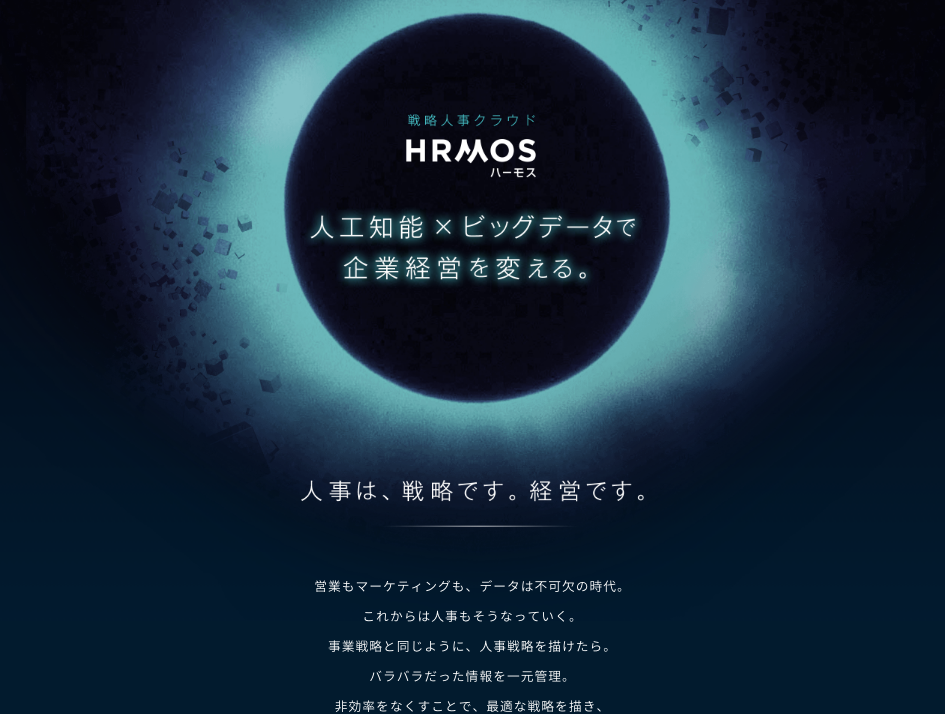

---


---


---


---

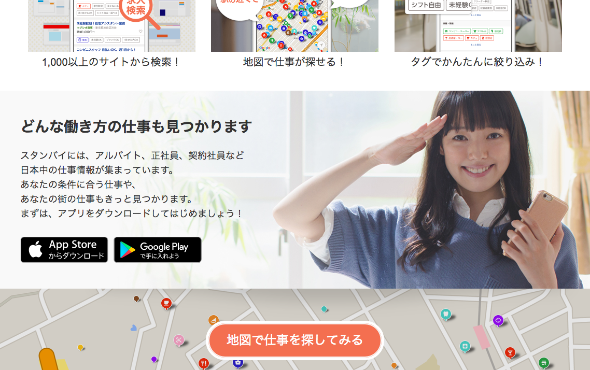

---

## HRMOSとはなんなのか

---

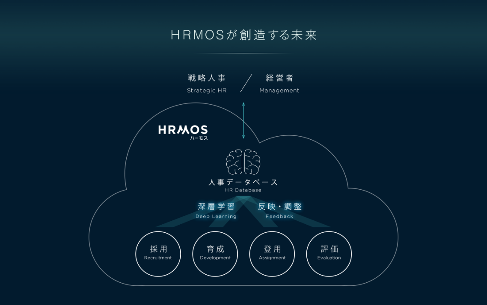

---

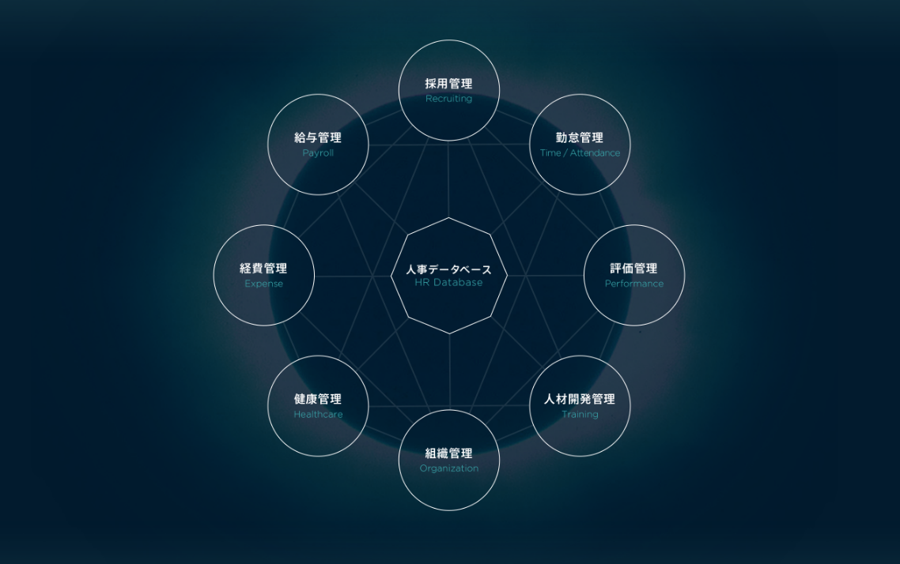

---

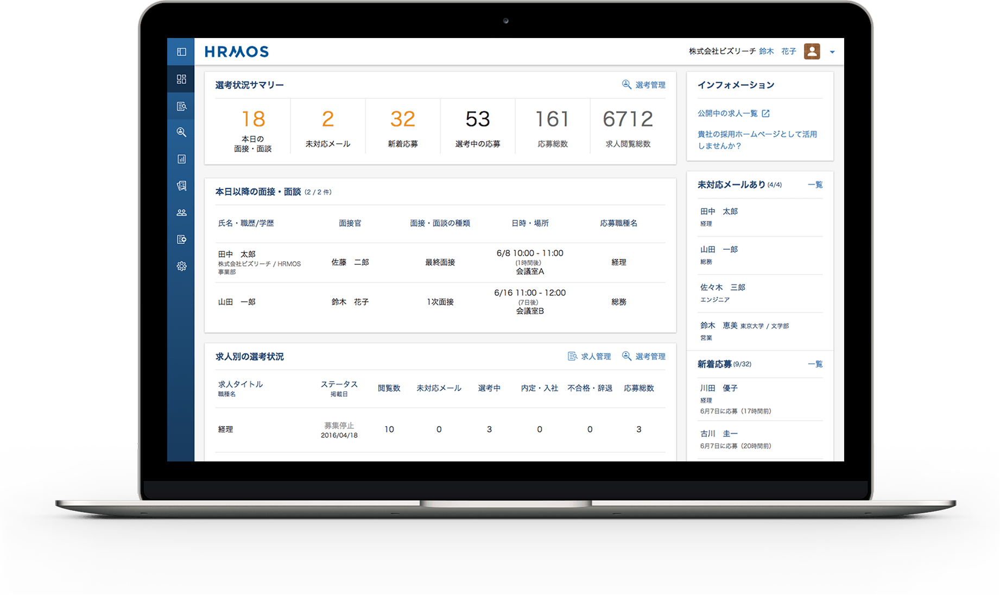

---

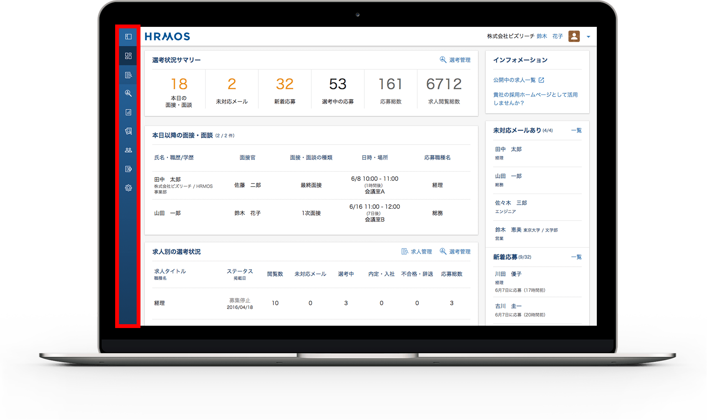

---

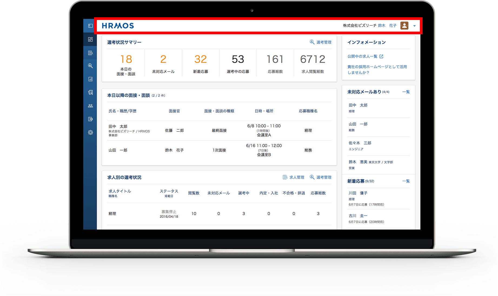

---

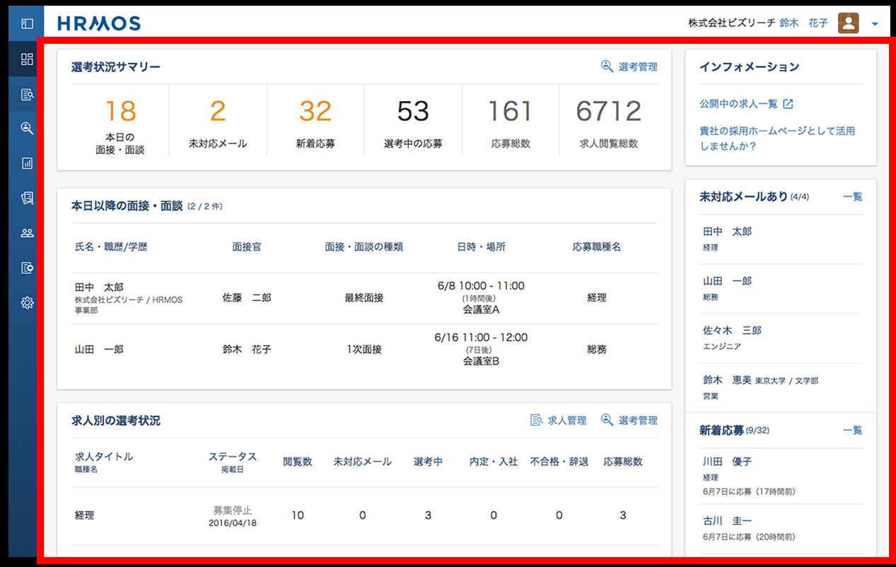

---

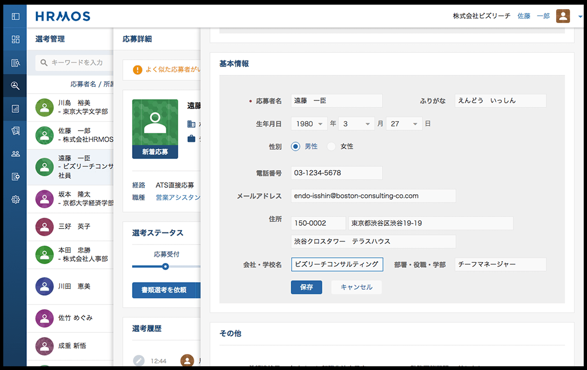

---

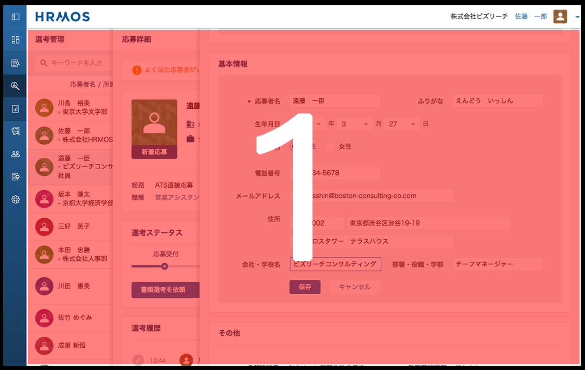

---

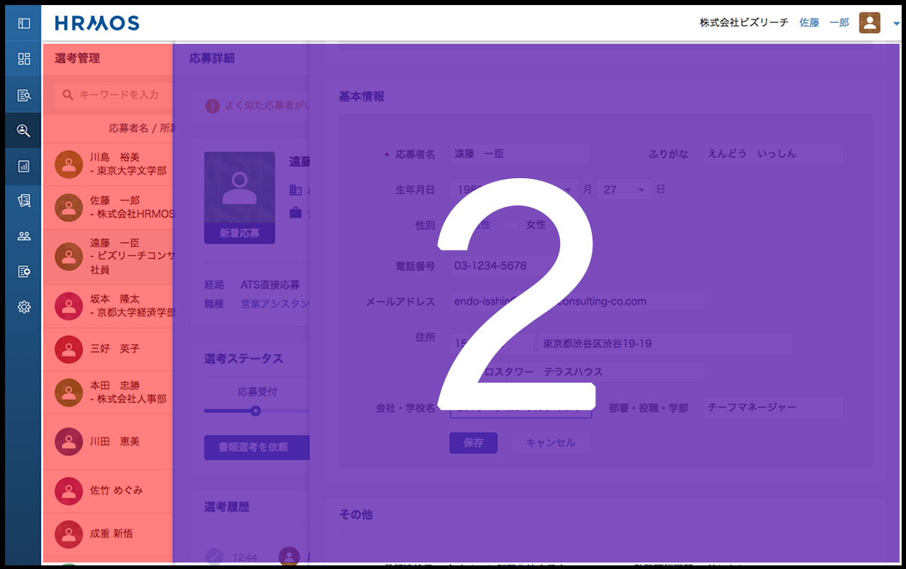

---

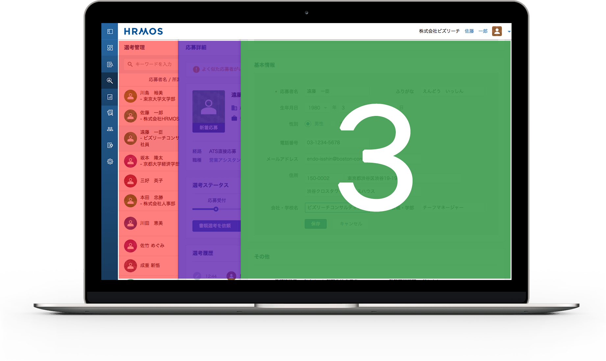

---

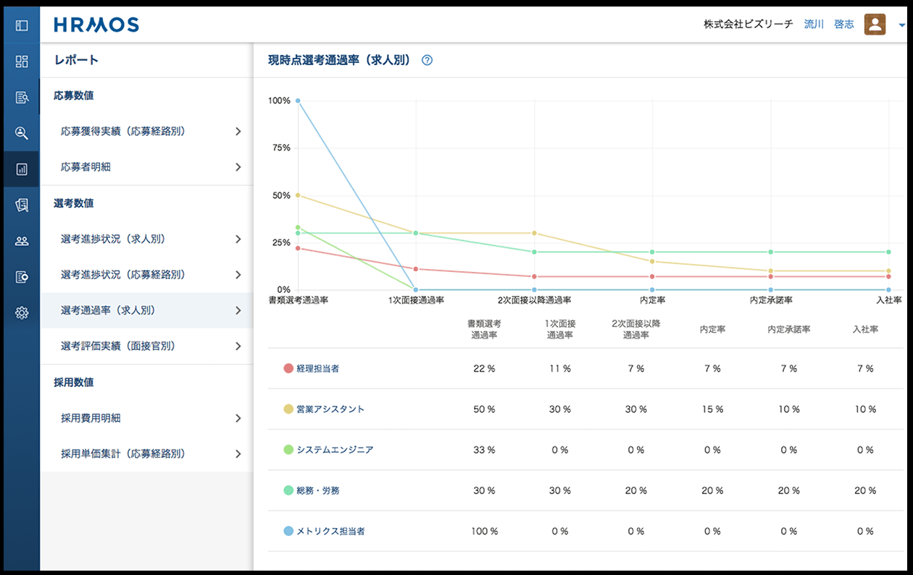

---

## 技術スタック

---

## 技術スタック

### デザイン

---


---


---

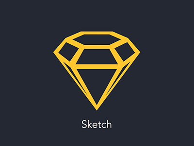

---


---

## 技術スタック

### フロントエンド

---


---


---


---


---


---


---


---


---


---


---

## 技術スタック

- チームコミュニケーション

---


---


---


---


---


---

## 技術スタック

- その他サーバサイド的なものたち
  - Java
  - Scala
  - Python
  - Play Framework
  - Slick
  - Nginx
  - MySQL
  - Elasticsearch
  - Memcached
  - Docker
  - Ansible
  - SQS
  - CloudFront
  - Jenkins
  - Kibana
  - Mailgun
  - etc...

---

# \#2 フロントエンド開発のルールづくり

---

# \#2 フロントエンド開発のルールづくり

ルールって何？

---

## ルールって何？

- こたえ:

--

  - 複数の開発者が

--

  - 共通の認識・価値観を持ち

--

  - お互いの作業を理解し

--

  - 無駄な / 重複した / 危険な 仕事をしないための

--

  - 明文化された規則

---

## 9 Boxの考え方

--

```
//

            1             2             3

            4             5             6

            7             8             9

//
```

---

## 案１

```
<table>
  <tbody>
    <tr> <td>1</td> <td>2</td> <td>3</td> </tr>
    <tr> <td>4</td> <td>5</td> <td>6</td> </tr>
    <tr> <td>7</td> <td>8</td> <td>9</td> </tr>
  </tbody>
</table>
```

---

## 案２

```
<ol>
  <li>1</li> <li>2</li> <li>3</li>
  <li>4</li> <li>5</li> <li>6</li>
  <li>7</li> <li>8</li> <li>9</li>
</ol>
```

---

## 案３

```
<ol>
  <li>1</li> <li>2</li> <li>3</li>
</ol>
<ol>
  <li>4</li> <li>5</li> <li>6</li>
</ol>
<ol>
  <li>7</li> <li>8</li> <li>9</li>
</ol>
```

---

## 案４

```
<p>123</p>
<p>456</p>
<p>789</p>
```

---

## 9 Box

- 正解は無い

--

- => 状況によって正解が分かれる

--

- => コードは、機械（ブラウザ・クローラ・データ）のためでもあるが
- => 人間（開発者・チームメンバ）のためでもある

--

### >>> _状況_ によって _正解_ を使い分けるためのルール

---

## では _正解_ とはなんなのか

--

1. 認知・改変が容易で、サーバサイドとの親和性があること
1. コンポーネント化による重複の排除
1. 基礎構造・部分構造の分割
1. セレクタの構造化
1. 簡潔な状態定義

---

## 認知・改変が容易？サーバサイドとの親和性？

--

- 認知 => コードからUIが想像できること

--

```
<div>
  <div>
    <div>
      (´･_･`)
    </div>
  </div>
</div>
```

---

## 認知・改変が容易？サーバサイドとの親和性？

- 改変 => ひとつの修正で複数が崩れる、または他の箇所の修正が漏れるということがないように

--

  - コンポーネント化（後述）

---

## 認知・改変が容易？サーバサイドとの親和性？

- サーバサイドとの親和性 => 受け取ったJSONをforEachするだけ、みたいな

--

  - データを受け取って画面に表示するときの効率を考慮する

---

## コンポーネント化による重複の排除？

---

## 例：

```
- base/
- app/
```

---

## 例：

```
▼ base/
  - config/
  - constants/
  - components/
  - helpers/
- app/
```

---

## 例：

```
▼ base/
  - config/
  - constants/
  ▼ components/
    - header.html.tpl
    - _header.scss
    - footer.html.tpl
    - _footer.scss
    - navigation.html.tpl
    - _navigation.scss
  - helpers/
- app/
```

---

## 例：

```
▼ base/
  - config/
  ▼ constants/
    - constants.ts // 定数（後述）
    - enums.ts // Enum（後述）
  - components/
  - helpers/
- app/
```

---

## 例：

```
- base/
▼ app/
  - login/
  - dashboard/
  - applications/
  - jobs/
```

---

## 例：

```
- base/
▼ app/
  ▼ login/
    - index.html.tpl
    - _login-index.scss
    - _login-index.ts
  - dashboard/
  - applications/
  - jobs/
```

---

## 共通構造と非共通構造は排他的に管理できるのか？

---

## 基礎構造・部分構造の分割

--

- sgクラス
- pgクラス

---

## 基礎構造・部分構造の分割

- sg => style-guide => 基礎構造
- pg => paged-guide => 部分構造

---

## 基礎構造・部分構造の例：

```
<section>
  <h2>見出し</h2>
  <p>見出しを補足するテキスト</p>
  <div>
    <figure>
      
    </figure>
    <p>本文テキスト</p>
  </div>
</section>
```

---

## 基礎構造・部分構造の例：

```
<section class="sg-container"> <- 基礎となるcontainer
  <h2>見出し</h2>
  <p>見出しを補足するテキスト</p>
  <div>
    <figure>
      
    </figure>
    <p>本文テキスト</p>
  </div>
</section>
```

---

## 基礎構造・部分構造の例：

```
.sg-container { }
```

--

```

.sg-container + * { }
```

--

```

.sg-container > h2 { }
```

---

## 基礎構造・部分構造の例：

```
<section class="sg-container"> <- 基礎となるcontainer
  <h2>見出し</h2>
  <p>見出しを補足するテキスト</p>
  <div>
    <figure>
      
    </figure>
    <p>本文テキスト</p>
  </div>
</section>
```

---

## 基礎構造・部分構造の例：

```
<section class="sg-container">
  <h2>見出し</h2>
  <p>見出しを補足するテキスト</p>
  <div>
    <figure class="pg-inner-images"> <- 部分追加した構造
      
    </figure>
    <p>本文テキスト</p>
  </div>
</section>
```

---

## 基礎構造・部分構造の例：

```
.pg-inner-images { }

.pg-inner-images > img { }
```

--

```

.sg-container .pg-inner-images { }
```

---

## セレクタの構造化？

--

```
.sg-container p { }

.sg-container > p { }

.sg-container + p { }

.sg-container ~ p { }
```

---

## セレクタの構造化？

```
<ul>
  <li class="sg-item"></li>
  <li class="sg-item"></li>
  <li class="sg-item"></li>
</ul>

.sg-item { }
```

---

## セレクタの構造化？

```
<ul class="sg-item-list">
  <li></li>
  <li></li>
  <li></li>
</ul>

.sg-item-list > li { }

^ すっきりした！
```

---

## セレクタの構造化？

```
<div>
  <p class="m_05"></p>
  <p class="m_05"></p>
  <p class="m_05"></p>
</div>
```

--

```
^ クラスが意味を持っていない。「なぜ？」がわからない。
```

---

## 簡潔な状態定義？

--

```
<ul>
  <li class="sg-item-normal"></li>
  <li class="sg-item-active"></li>
  <li class="sg-item-disabled"></li>
</ul>
```

---

## 簡潔な状態定義？

```
<ul class="sg-item-list">
  <li></li>
  <li class="active"></li>
  <li class="disabled"></li>
</ul>
```

--

```

.sg-item-list > li { }
.sg-item-list > li.active { }
.sg-item-list > li.disabled { }
```

---

## idによるDOM制御

--

```
<button id="jsi-menu-trigger">MENU</button>
```

--

```

<button class="jsc-cta-trigger">問い合わせ</button>
```

---

## コードレビューによる品質担保

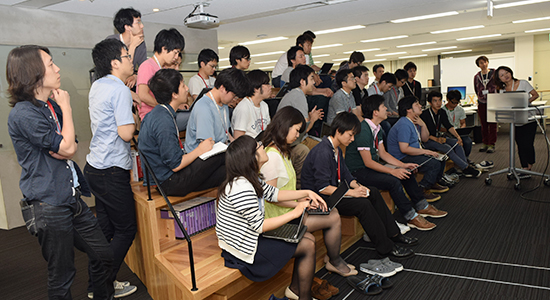

---

## コードレビューによる品質担保

--

- _正解_ かどうか（考え方が合っているか）の確認

--

- 責任の共有

--

- 個人の技術が止まることを防止

--

- TODOの整理

---

## TODOといえば

--

HRMOSの半分はTODOでできています

--


---

## こんなのとか

```
<!-- TODO(名前): あとでここをこうする -->
```

---

## こんなのとか

```
/* NOTE(名前): ここの数字を変えるときはこうしてね */
```

---

## こんなのとか

```
// FIXME(名前): やり方わかんないから
// 誰かここをこうしてほしいなあ(´･_･`)
```

---

## 文芸的プログラミング

https://ja.wikipedia.org/wiki/文芸的プログラミング

---

## TODOやNOTEはweeklyで管理

--

- 管理？（後述）

---

# \#3 HRMOSを支える技術

--

1. TypeScriptによる型定義
1. ルールを逸脱したコードを自動検知
1. ユーザ操作によるエラーログ抽出

---

## TypeScriptによる型定義

--

```
// 普通のJavaScript
var foo = 5;
var foo = 'hogehoge';
var foo = false;
```

---

## TypeScriptによる型定義

```
// TypeScriptによる型定義 (+ ES6)
let foo: number  = 5;
let foo: string  = 'hogehoge';
let foo: boolean = false;
```

---

## 扱う値を開発中に厳密に管理

- String
- Boolean
- Number
- Date
- Object
- など

---

## 型だけじゃなく、中身もあらかじめ定義しちゃおう

--

```
▼ base/
  - config/
  ▼ constants/
    - constants.ts <- ここ
    - enums.ts     <- ここ
  - components/
  - helpers/
- app/
```

---

## constantsによる定数の定義（例）

--

```
const Constants = {
  SERVICE_NAME = 'HRMOS[ハーモス]';
  COMPANY_NAME = '株式会社ビズリーチ';
  ROOT_URL     = 'https://www.hrmos.co/';
}
```

---

## constantsによる定数の定義（例）

```
const Constants = {
  SERVICE_NAME = 'HRMOS[ハーモス]';
  COMPANY_NAME = '株式会社ビズリーチ';
  ROOT_URL     = 'https://www.hrmos.co/';

  GOOGLE_CALENDAR = 'Google カレンダー&trade;'
}
```

---

## Enumによる定数配列の定義（例）

--

```
class Roles {
  General = { code: 'GEN', name: '一般社員', limited: false };
  Interviewer = { code: 'INT', name: '面接官', limited: false };
  Recruiter = { code: 'REC', name: '人事部', limited: true };
  Administrator = { code: 'ADM', name: '管理者', limited: true };
}
```

---

## フロントエンドで語彙がバラつかない！

```
<p>{{ $enums.roles.Interviewer.name }}</p>

 => <p>面接官</p>
```

---

## サーバサイドから受け取ったコードがそのまま使える！

```
this.role: string = 'INT';

↑ こんなデータが渡されてきたら...
```

--

```

<p>あなたの権限は{{ $enums.roles.valueOf(this.role).name }}です<p>

  => <p>あなたの権限は面接官です<p>
```

---

## 定義してもルールが破られるものもある

--

- ルールを逸脱したコードを自動検知

--

  - HTML-Lint (HTML)
  - Sass-Lint (SCSS)
  - Ts-Lint   (TypeScript)
  - Es-Lint   (ECMAScript)

---

## ルールを逸脱したコードを自動検知

--

- weeklyでレポートを自動生成

--

- 前週と比較して、
  - 未定義のカラーコードが増えていないか
  - 根拠の無いwidth値が指定されていないか
  - 使ってないのに定義してる変数が増えていないか
  - あっちとこっちに同じプロパティのスタイルを定義していないか

--

- cf: npm gulp-htmllint, gulp-sasslint, gulp-tslint, etc...

---

## ついでにTODOコメントの進捗状況も

--

```
- AさんはTODOが 25(+4) 個ありますよー (´･_･`)
- BさんはTODOが 39(-12) 個ありますよー o(^▽^)o
- PJ内には全部で 403(-22) 個のTODOがありますよー o(^▽^)o
```

--

- cf: npm gulp-todo

---

## ユーザ操作によるエラーログ抽出

--

- コードが正しくて、理念に合っていても、思わぬエラーは発生する

--

- 例）あるページを開いて30分経過してからあるボタンをクリックしたらエラー

--

```
＿人人人人人人人人人＿
＞　画面が真っ白に　＜
￣Y^Y^Y^Y^Y^Y^Y^Y￣
```

--

（実際はそんなこと起きません）

---

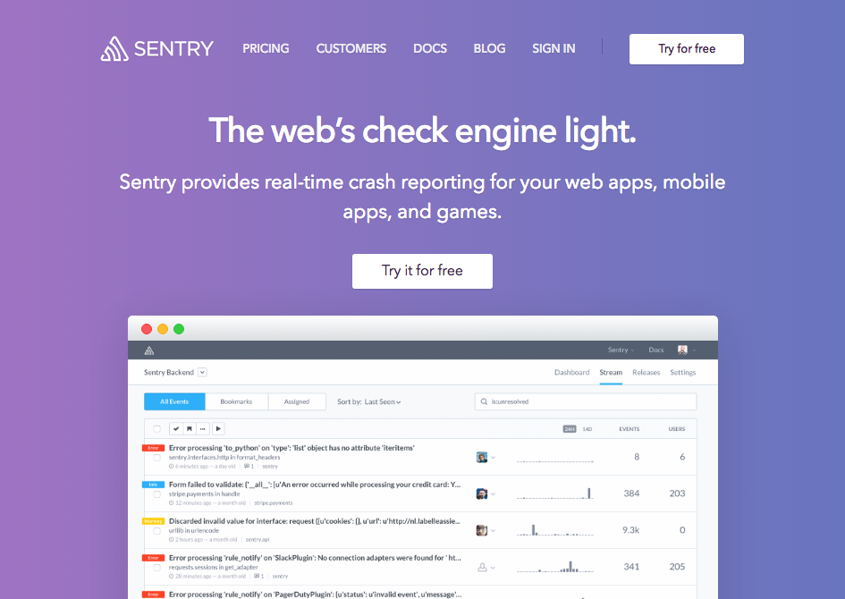

---

# \#4 チームマネジメント

---

## デザイナとフロントエンドエンジニアの関係

--

- あってはいけないこと

--

1. デザイナーが実装可能性を気にすること
1. デザイナーが把握していないデザインが勝手に実装されること
1. デザイナーの意図が捻じ曲げられること

---

## デザイナが実装可能性を気にすること

--

- (´･\_･\`)「これって技術的にできるのかなあ...」

--

  - 実装可能性はフロントエンドエンジニアの力量の問題であり、デザイナにフィージビリティを考えさせてはいけない。
  - デザイナも、フロントの工数や実装の複雑さを考慮することがあってはいけない。

---

## デザイナが把握していないデザインが実装されること

--

- （\*＾▽゜）「時間無いから直接コード書きながらデザイン考えたろ」

--

  - 直接コードを書く => コードの癖やその人が得意な実装がデザインに反映される

---

## デザイナの意図が捻じ曲げられること

--

- 彡(゜)(゜)「ここのpaddingってたぶん10pxやろ」

--

  - フロントエンドエンジニアはデザインの _意図_ を理解して _正解_ の実装をしなければいけない

---

## 日々の仕事上のコミュニケーション

--

- （\*＾▽゜）「リファクタしたよ」 => 

--

- （\*＾▽゜）「なんか気になったから直したよ」 => 

--

- （\*＾▽゜）「もっと短い書き方あったよ」 => 

--

- （\*＾▽゜）「暇つぶしにバナー作ったよ」 => 

--

- （\*＾▽゜）「タスクをアサインしといたよ」 => 

---

## 日々の仕事上のコミュニケーション

- お互いフラットに意見が言える環境であること
- 日々頻繁に、手軽にチャットができること
  - これらは、 _デザイナ同士_ 、_フロントエンドエンジニア同士_ でも同じことがいえる

---

## 最後に


---

## ご参加いただきありがとうございました。

- 懇親会について

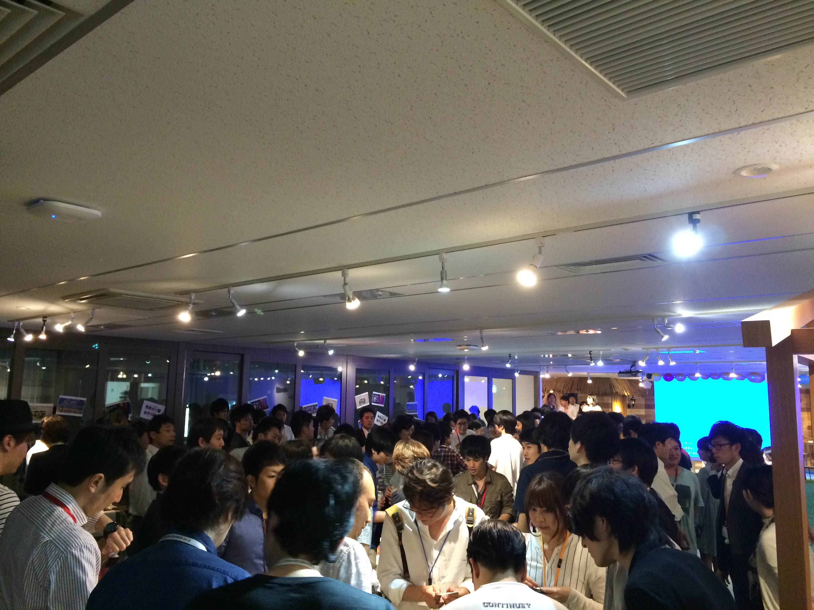

---

class: center, middle

# *intentionally left blank*
