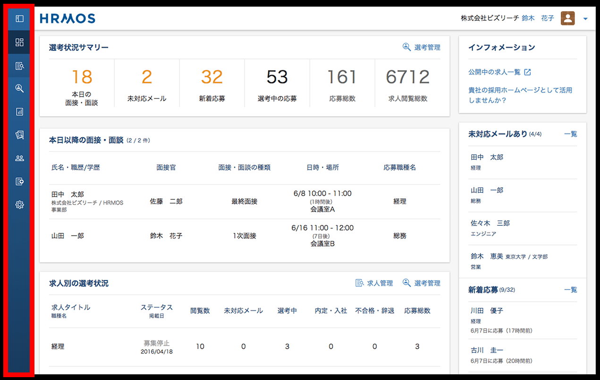
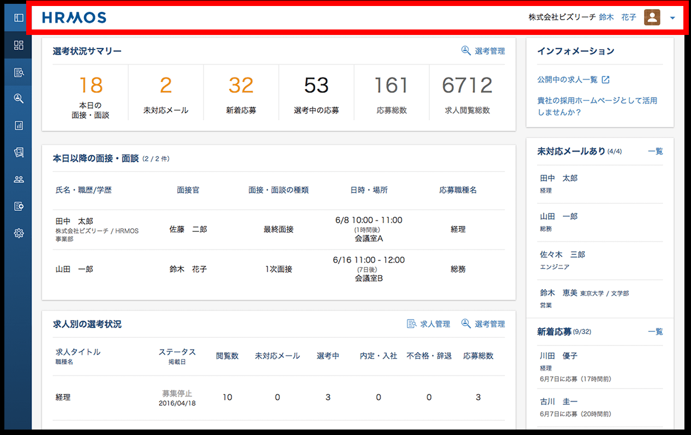
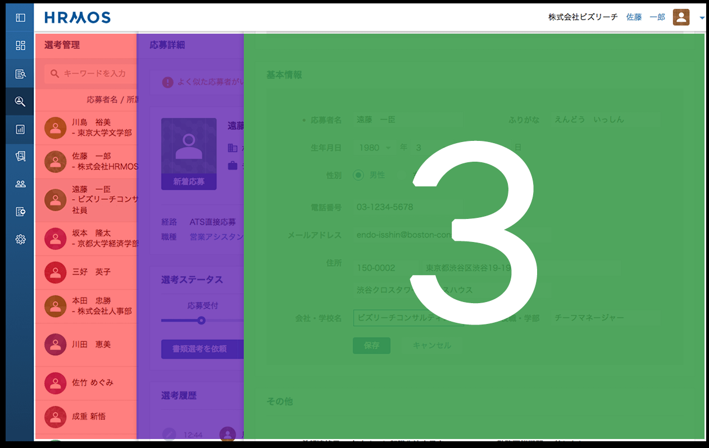

class: center, middle

# *intentionally left blank*

---

class: img-slide


---

## wi-fi

| SSID | Password |
|:-----------|:-----------|
| BIZREACH_GUEST | iwilljoinbizreach |

## Twitter Hash Tag

\#dcubeio

## お手洗い

後ろの左側へ。

## スケジュール

| 19:30 | 20:15 | 20:30 | 22:00 |
|:-----------|:-----------|:-----------|:-----------|
| 第１部発表 | 第２部発表 |   | 完全撤収 |

---

# フロントエンド&lt;チーム開発 /&gt;成功の裏話


---

## Kyoya BABA

- 28
- 札幌
- 2010 エディトリアルマネージャー
- 2011 プロジェクトマネージャー
- 2012 マーケティングマネージャー
- 2013 ウェブデザイナー
- 2014 フリーランス
- 2015 フロントエンドエンジニア <- 今ここ

---

## SNS

| Facebook | Twitter | LinkedIn |
|:-----------:|:-----------:|:-----------:|
|  |  |  |
| Qiita | filmarks | LINE |
|  |  |  |

---

## Kyoya BABA

### 株式会社ビズリーチHRMOS事業部
### フロントエンドエンジニア

--

- UI / UXデザイン
- フロントエンドコーディング
- 広告マーケティング

--

```
＿人人人人人人人人人人人人人人人人＿
＞　人が足りないから来てください　＜
￣Y^Y^Y^Y^Y^Y^Y^Y^Y^Y^Y^Y^Y^Y^Y￣
```

---

## アジェンダ

- 第１部（45mins, Kyoya BABA）
  - \#1 プロダクトについて
  - \#2 フロントエンド開発のルールづくり
  - \#3 HRMOSを支える技術
  - \#4 チームマネジメント
  - \#5 質疑応答
- 第２部（15mins, Masahiko ASAI）
  - \#1 僕がHRMOSのフロントエンド開発で心がけていること
  - \#2 質疑応答
-   (90mins)

---

# \#1 プロダクトについて

---


---


---


---


---


---

## HRMOSとはなんなのか

---


---


---


---



---



---


---


---


---


---



---

## ごくごく簡単なデモ

<!-- NOTE: 本番のデータが変ではない選考管理画面で、履歴書を編集したり面接を設定したりしてみる -->

---


<!-- NOTE: 人工知能やで〜 -->

---

## 技術スタック

<!-- NOTE: 聴衆が比較的技術寄りの人間だと思うので、先に技術スタックの話をする。こういうツール使って作ってるんだよということを先に知ってもらってから、具体的な話をしたほうが理解してもらえる＆心の準備ができるのでは -->

---

## 技術スタック

### デザイン

---


---


---


---


---

## 技術スタック

### フロントエンド

---


---


---


---


---


---


---


<!-- NOTE: Reactについて話を振られても答えられないので、具体的な話はしない。状況に応じて最適なツールを使うという理念のもと、現在の選考管理ではAngularJS、今後の別のプロジェクトではReactで使っていく予定があるという程度の話だけする。先述したRegionUpという事業ではReactを使っているという話ならしてもいいかも？ -->

---


---


---


---

## 技術スタック

- チームコミュニケーション

---


---


---


---


---


---

## 技術スタック

- その他サーバサイド的なものたち
  - Java, Scala, Python, Play Framework
  Slick, Nginx, MySQL, Elasticsearch, Memcached, Docker, Ansible, SQS, CloudFront, Jenkins, Kibana, Mailgun, etc...

  <!-- !-- NOTE: いっぱいあるけどひとつもよくわからんという談笑スライド -->

---

# \#2 フロントエンド開発のルールづくり

---

# \#2 フロントエンド開発のルールづくり

そもそも _ルール_ って何？

---

## ルールって何？

- こたえ:

--

  - 複数の開発者が

--

  - 共通の認識・価値観を持ち

--

  - お互いの作業を理解し

--

  - 無駄な / 重複した / 危険な 仕事をしないための

--

  - 明文化された規則

---

## 9 Boxの考え方

--

```
//

            1             2             3

            4             5             6

            7             8             9

//
```

---

## 案１

```html
<table>
  <tbody>
    <tr> <td>1</td> <td>2</td> <td>3</td> </tr>
    <tr> <td>4</td> <td>5</td> <td>6</td> </tr>
    <tr> <td>7</td> <td>8</td> <td>9</td> </tr>
  </tbody>
</table>
```

---

## 案２

```html
<ol>
  <li>1</li> <li>2</li> <li>3</li>
  <li>4</li> <li>5</li> <li>6</li>
  <li>7</li> <li>8</li> <li>9</li>
</ol>
```

---

## 案３

```html
<ol>
  <li>1</li> <li>2</li> <li>3</li>
</ol>
<ol>
  <li>4</li> <li>5</li> <li>6</li>
</ol>
<ol>
  <li>7</li> <li>8</li> <li>9</li>
</ol>
```

---

## 案４

```html
<p>123</p>
<p>456</p>
<p>789</p>
```

---

## 9 Box

- 正解は無い

--

- => 状況によって正解が分かれる

--

- => コードは、機械（ブラウザ・クローラ・データ）のためでもあるが
- => 人間（開発者・チームメンバ）のためでもある

--

### >>> _状況_ によって _正解_ を使い分けるためのルール

---

## では _正解_ とはなんなのか

--

1. 認知・改変が容易で、サーバサイドとの親和性があること
1. コンポーネント化による重複の排除
1. 基礎構造・部分構造の分割
1. セレクタの構造化
1. 簡潔な状態定義

---

## 認知・改変が容易？サーバサイドとの親和性？

--

- _認知_ => コードからUIが想像できること

--

```html
<div>
  <div>
    <div>
      (´･_･`)
    </div>
  </div>
</div>
```

---

## 認知・改変が容易？サーバサイドとの親和性？

- _改変_ => ひとつの修正で複数が崩れる、または他の箇所の修正が漏れることがないように（効率的に）画面に手を加えること

--

  - コンポーネント化（後述）

---

## 認知・改変が容易？サーバサイドとの親和性？

- サーバサイドとの親和性 => 受け取ったJSONをforEachするだけ、みたいな

--

  - データを受け取って画面に表示するときの効率を考慮する

<!-- NOTE: フロントとサーバーが仲わるいプロジェクトチームってよくあるけど、僕らはお互いにコミュニケーションをとりあってアジャイル開発をしています。フロントエンドで必要なデータをサーバーサイドエンジニアに伝えて渡してもらう。サーバーサイドでどうしても対応が難しい簡略化はフロントエンドでデータを整理して画面に反映する。
-->

---

## コンポーネント化による重複の排除？

---

## 例：

```
- base/
- app/
```

---

## 例：

```
▼ base/
  - config/
  - constants/
  - components/
  - helpers/
- app/
```

---

## 例：

```
▼ base/
  - config/
  - constants/
  ▼ components/
    - header.html.tpl
    - _header.scss
    - footer.html.tpl
    - _footer.scss
    - navigation.html.tpl
    - _navigation.scss
  - helpers/
- app/
```

<!-- NOTE: 関係するファイルは同じところにあるので、何度も同じフォルダを行き来したりする必要はないよ。headerだけいじるぞーっていう人はここのheaderのhtmlとcss（ある場合はjavascriptのファイル）だけをひたすらいじれば仕事ができるから、他の開発者と衝突することはないよ。 -->

---

## 例：

```
▼ base/
  - config/
  ▼ constants/
    - constants.ts // 定数（後述）
    - enums.ts // Enum（後述）
  - components/
  - helpers/
- app/
```

---

## 例：

```
- base/
▼ app/
  - login/
  - dashboard/
  - applications/
  - jobs/
```

---

## 例：

```
- base/
▼ app/
  ▼ login/
    - index.html.tpl
    - _login-index.scss
    - _login-index.ts
  - dashboard/
  - applications/
  - jobs/
```

---

## 共通構造と非共通構造は排他的に管理できるのか？

<!-- NOTE: とはいえ、実際にウェブのコーディングをしていると、こことあそこで同じクラスを使っていたり、こっちを変えるとこっちを変えたり、ここを消したらここのmarginがなくなっちゃたり。。。みたいなことが起こる。そういうトラブルがなく、各構造ごとに排他的に処理ができるようにするために、僕らは何をしているのか。 -->

---

## 基礎構造・部分構造の分割

--

- sgクラス
- pgクラス

<!-- NOTE: これはHRMOSというわけではなく、弊社全体で適用しているルールですが -->

---

## 基礎構造・部分構造の分割

- sg => style-guide => 基礎構造
- pg => paged-guide => 部分構造

---

## 基礎構造・部分構造の例：

```html
<section>
  <h2>見出し</h2>
  <p>見出しを補足するテキスト</p>
  <div>
    <figure>
      
    </figure>
    <p>本文テキスト</p>
  </div>
</section>
```

---

## 基礎構造・部分構造の例：

```html
<section class="sg-container"> <!-- 基礎となるcontainer -->
  <h2>見出し</h2>
  <p>見出しを補足するテキスト</p>
  <div>
    <figure>
      
    </figure>
    <p>本文テキスト</p>
  </div>
</section>
```

---

## 基礎構造・部分構造の例：

```css
.sg-container { }
```

--

```css

.sg-container + * { }
```

--

```css

.sg-container > h2 { }
```

---

## 基礎構造・部分構造の例：

```html
<section class="sg-container">
  <h2>見出し</h2>
  <p>見出しを補足するテキスト</p>
  <div>
    <figure class="pg-inner-images"> <!-- 部分追加した構造 -->
      
    </figure>
    <p>本文テキスト</p>
  </div>
</section>
```

---

## 基礎構造・部分構造の例：

```css
.pg-inner-images { }

.pg-inner-images > img { }
```

--

```css

.sg-container .pg-inner-images { }
```

---

## セレクタの構造化？

--

```css
.sg-container p { }

.sg-container > p { }

.sg-container + p { }

.sg-container ~ p { }
```

---

## セレクタの構造化？

```html
<ul>
  <li class="sg-item"></li>
  <li class="sg-item"></li>
  <li class="sg-item"></li>
</ul>
```
```css
.sg-item { }
```

---

## セレクタの構造化？

```html
<ul class="sg-item-list">
  <li></li>
  <li></li>
  <li></li>
</ul>
```
```css
.sg-item-list > li { }
```
```
^ すっきりした！
```

<!-- NOTE: CSSだけを見ると長くなった感じがしますが、sg-itemというのがなんのitemなのかという「認知」の観点からリスト要素を包含する親要素なんだ、ということが感覚的にわかるようになります。また、仮にリスト要素が100個とかになったときに、DOM上に大量のclassがレンダリングされるということがなくなります。 -->

---

## セレクタの構造化？

```html
<div>
  <p class="m_05"></p>
  <p class="m_05"></p>
  <p class="m_05"></p>
</div>
```

<!-- NOTE: 昔こういうのあったよねー -->

--

```
^ クラスが意味を持っていない。「なぜ？」がわからない。
```

<!-- NOTE: クラスは名前空間を定義するものであり、どんなスタイルを適用するかを示すものではない。マージンをつけたいときにマージンというクラスをつけるのであれば、どういう状況でどういう状態のときにマージンをつけるのかという指針も見えないし、なぜ５なのかということも判断できない。デザイナーが考えたコンセプトを形にする上で、表面的な見た目の特徴を命名規則として使ってしまうことは愚かである。 -->

---

## 簡潔な状態定義？

--

```html
<ul>
  <li class="sg-item-normal"></li>
  <li class="sg-item-active"></li>
  <li class="sg-item-disabled"></li>
</ul>
```

---

## 簡潔な状態定義？

```html
<ul class="sg-item-list">
  <li></li>
  <li class="active"></li>
  <li class="disabled"></li>
</ul>
```

--

```css

.sg-item-list > li { }
.sg-item-list > li.active { }
.sg-item-list > li.disabled { }
```

---

## idによるDOM制御

--

```html
<button id="jsi-menu-trigger">MENU</button>
```

--

```html

<button class="jsc-cta-trigger">問い合わせ</button>
```

<!-- NOTE: 複数のときはクラスもつけるけど、スタイルではないからjs-classであることを示すよー -->

---

## コードレビューによる品質担保


---

## コードレビューによる品質担保

<!-- NOTE: 先ほどお伝えしたこととかぶりますが、以下のようなことを紹介しました -->

--

- _正解_ かどうか（考え方が合っているか）の確認

<!-- NOTE: お互いのコードを見て、なぜこういう作り方にしたのか。このほうが情報設計の意図にあっているのではないか。このほうが見た目がシンプルじゃないか、という議論を交わします -->

--

- 責任の共有

<!-- NOTE: さらに、レビュアーがOKを出すということは、他人のコードやプログラムの責任を共有するということになる。「ほかの人が作ったページのことなんて知らない」という個人プレーには決してならない。 -->

--

- 個人の技術が止まることを防止

--

- TODOの整理

---

## TODOといえば

--

HRMOSの半分はTODOでできています

--


---

## こんなのとか

```html
<!-- TODO(名前): あとでここをこうする -->
```

---

## こんなのとか

```css
/* NOTE(名前): ここの数字を変えるときはこうしてね */
```

---

## こんなのとか

```javascript
// FIXME(名前): やり方わかんないから
// 誰かここをこうしてほしいなあ(´･_･`)
```

---

## 文芸的プログラミング

- https://ja.wikipedia.org/wiki/文芸的プログラミング

<!-- NOTE: 我々はとにかく大量のコメントを入れる主義。ドキュメントをワードやエクセルで作っても誰も見ない。というか自分もそれを開くのめんどくさい。コードを修正したり確認したりするときにいっしょに仕様が確認できるのが一番楽である。ちなみに、コードはコンパイルされてなくなる。 -->

---

## コードを書く = 仕様書を作る

--

- gulp-styledocco
- gulp-ngDoc

---

## コードを書く = 仕様書を作る

```css
/* # ボタン
 * ## 優先度により補助クラスを指定
 * '''
 * <a href="#" class="sg-button">通常のボタン</a>
 * <a href="#" class="sg-button primary">プライマリアクション</a>
*/ '''
.sg-button {
  ...
  &.primary {
    ...
  }
}
```

---

## コードを書く = 仕様書を作る


---

## コードを書く = 仕様書を作る

- AngularJSのカスタムディレクティブ

```javascript
/**
 * @ngdoc directive
 * @example
    <example module="sampleElemExample" deps="" animate="false">
      <file name="index.html"><sample-elem></sample-elem></file>
      <file name="main.js">angular.module('sampleElemExample', ['exampleOfGeneratorNgdoc']);</file>
    </example>
 **/
angular.module('exampleOfGeneratorNgdoc').directive('sampleElem', function () {
  return {
    restrict: 'E',
    template: '<div class="sample-awesome">Hello, AngularJS directive!</div>'
  };
});
```
quo: http://qiita.com/Quramy/items/42418def7c8e6544a415

---

## TODOやNOTEはweeklyで管理

<!-- NOTE: 上述したようなコメントは、ただ増えていくだけだと結局ゴミの山になるので、管理が必要です。 -->

--

- 管理？（後述）

<!-- NOTE: 具体的な「管理＝マネジメント」をどのようにしているかについては後述します -->

---

# \#3 HRMOSを支える技術

--

1. ES6(ES2015)によるJavaScriptコーディング
1. TypeScriptによる型定義
1. ルールを逸脱したコードを自動検知
1. ユーザ操作によるエラーログ抽出

---

## ES6(ES2015)によるJavaScriptコーディング

--

- 仕様策定中のECMAScript6を採用

--

  - 最終的に各種ブラウザで動作するようにトランスパイル（変換）するので、表に見えるコードは普通のJavaScript
  - 書いてて楽しい <- ここ重要

---

## ES6(ES2015)によるJavaScriptコーディング

- 具体的にどんなことが楽しいのか

---

## 関数スコープからブロックスコープへ、そして定数定義へ

--

```javascript
// Before:
var prefecture = 'Tokyo';
var COUNTRY = 'Japan'
```

--

```javascript

// After:
let prefecture = 'Tokyo'; <- ブロックスコープ内でのみ参照
const country = 'Japan'; <- 二度と上書きできない
```

---

## 連結HTMLからの解放

--

```javascript
// Before:
var callToAction  = '<p>';
var callToAction += '<a href="#">';
    callToAction += 'ボタンのテキスト';
    callToAction += '</a>';
    callToAction += '</p>';
```

---

## 連結HTMLからの解放

```javascript
// After:
let callToAction = `
  <p>
    <a href="#">
      ボタンのテキスト
    </a>
  </p>
`;
```

---

## 連結stringからの解放

```javascript
// Before:
var date = today.month() + '月' + today.day() + '日';
```

--

```javascript

// After:
let date = `${today.month()}月${today.day()}日`;
```

---

## アロー関数によるスコープ

--

```javascript
// Before:
doSomething = function(e) { return e; }
```

--

```javascript

// After:
doSomething = (e) => e;
```

---

## クラス、コンストラクタがフロントエンドにも

--

```javascript
class Men {
  constructor(name) {
    this.name = name;
  }
  greeting() {
    return `私は${this.name}です`;
  }
}
```

---

## ES6(ES2015)によるJavaScriptコーディング

- その他詳しくはネットサーフィンにて。
  - ES2015 (ES6)についてのまとめ
  - http://qiita.com/tuno-tky/items/74ca595a9232bcbcd727

---

## TypeScriptによる型定義

--

```javascript
// 普通のJavaScript
var foo = 5;
var foo = 'hogehoge';
var foo = false;
```

---

## TypeScriptによる型定義

```javascript
// TypeScriptによる型定義 (+ ES6)
let foo: number  = 5;
let foo: string  = 'hogehoge';
let foo: boolean = false;
```

---

## 扱う値を開発中に厳密に管理

- String
- Boolean
- Number
- Date
- Object
- など

---

## 型だけじゃなく、ついでに中身もあらかじめ定義しちゃおう

--

```
▼ base/
  - config/
  ▼ constants/
    - constants.ts <- ここ
    - enums.ts     <- ここ
  - components/
  - helpers/
- app/
```

---

## constantsによる定数の定義（例）

--

```javascript
const Constants = {
  SERVICE_NAME = 'HRMOS[ハーモス]';
  COMPANY_NAME = '株式会社ビズリーチ';
  ROOT_URL     = 'https://www.hrmos.co/';
}
```

---

## constantsによる定数の定義（例）

```javascript
const Constants = {
  SERVICE_NAME = 'HRMOS[ハーモス]';
  COMPANY_NAME = '株式会社ビズリーチ';
  ROOT_URL     = 'https://www.hrmos.co/';

  GOOGLE_CALENDAR = 'Google カレンダー&trade;'
}
```

---

## Enumによる定数配列の定義（例）

--

```javascript
class Roles {
  General = { code: 'GEN', name: '一般社員', limited: false };
  Interviewer = { code: 'INT', name: '面接官', limited: false };
  Recruiter = { code: 'REC', name: '人事部', limited: true };
  Administrator = { code: 'ADM', name: '管理者', limited: true };
}
```

---

## フロントエンドで語彙がバラつかない！

```html
<p>{{ $enums.roles.Interviewer.name }}</p>

 => <p>面接官</p>
```

---

## サーバサイドから受け取ったコードがそのまま使える！

```javascript
this.role: string = 'INT';

↑ こんなデータが渡されてきたら...
```

--

```html

<p>あなたの権限は{{ $enums.roles.valueOf(this.role).name }}です<p>

  => <p>あなたの権限は面接官です<p>
```

---

## 定義してもルールが破られるものもある

--

- ルールを逸脱したコードを自動検知

--

  - HTML-Lint (HTML)
  - Sass-Lint (SCSS)
  - Ts-Lint   (TypeScript)
  - Es-Lint   (ECMAScript)

---

## ルールを逸脱したコードを自動検知

--

- weeklyでレポートを自動生成

--

- 前週と比較して、
  - 未定義のカラーコードが増えていないか
  - 根拠の無いwidth値が指定されていないか
  - 使ってないのに定義してる変数が増えていないか
  - あっちとこっちに同じプロパティのスタイルを定義していないか

--

- cf: npm gulp-htmllint, gulp-sasslint, gulp-tslint, etc...

---

## ついでにTODOコメントの進捗状況も

--

```
- AさんはTODOが 25(+4) 個ありますよー (´･_･`)
- BさんはTODOが 39(-12) 個ありますよー o(^▽^)o
- PJ内には全部で 403(-22) 個のTODOがありますよー o(^▽^)o
```

--

- cf: npm gulp-todo

---

## それ以前に、タイポとかヒューマンエラーもある

--

- Sass, TypeScriptでのトランスパイルエラー -> コンソールが止まるから気づく

--

- Sass-lint, ES-lint, TS-lintでのワーニング -> 怖いリーダーが直せと言ってくるから気づく

--

- TODO, FIXMEによるタスク -> 怖いリーダーが早くやれと言ってくるから気づく

--

- Pull Request Test（Github）-> エラーを孕む低品質なコードはマージできない

---

## ユーザ操作によるエラーログ抽出

--

- コードが正しくて、理念に合っていても、思わぬエラーは発生する

--

- 例）あるページを開いて30分経過してからあるボタンをクリックしたらエラー

--

```
＿人人人人人人人人人＿
＞　画面が真っ白に　＜
￣Y^Y^Y^Y^Y^Y^Y^Y￣
```

--

（実際はそんなこと起きません）

---


---

# \#4 チームマネジメント

---

## デザイナとフロントエンドエンジニアの関係

--

- あってはいけないこと

--

1. デザイナーが実装可能性を気にすること
1. デザイナーが把握していないデザインが勝手に実装されること
1. デザイナーの意図が捻じ曲げられること

---

## デザイナが実装可能性を気にすること

--

- (´･\_･\`)「これって技術的にできるのかなあ...」

--

  - 実装可能性はフロントエンドエンジニアの力量の問題であり、デザイナにフィージビリティを考えさせてはいけない。
  - デザイナも、フロントの工数や実装の複雑さを考慮することがあってはいけない。

--

  - もっというと、フロントエンドTOサーバー再度にも同じことが言える

---

## デザイナが把握していないデザインが実装されること

--

- （\*＾▽゜）「時間無いから直接コード書きながらデザイン考えたろ」

--

  - 直接コードを書く => コードの癖やその人が得意な実装がデザインに反映される

---

## デザイナの意図が捻じ曲げられること

--

- 彡(゜)(゜)「ここのpaddingってたぶん10pxやろ」

--

  - フロントエンドエンジニアはデザインの _意図_ を理解して _正解_ の実装をしなければいけない

---

## 日々の仕事上のコミュニケーション

--

- （\*＾▽゜）「リファクタしたよ」 => 

--

- （\*＾▽゜）「なんか気になったから直したよ」 => 

--

- （\*＾▽゜）「もっと短い書き方あったよ」 => 

--

- （\*＾▽゜）「暇つぶしにバナー作ったよ」 => 

--

- （\*＾▽゜）「タスクをアサインしといたよ」 => 

---

## 日々の仕事上のコミュニケーション

- お互いフラットに意見が言える環境であること
- 日々頻繁に、手軽にチャットができること
  - これらは、 _デザイナ同士_ 、_フロントエンドエンジニア同士_ でも同じことがいえる

---

## 最後に


---

## ご参加いただきありがとうございました。

- 懇親会について


---

class: center, middle

# *intentionally left blank*
