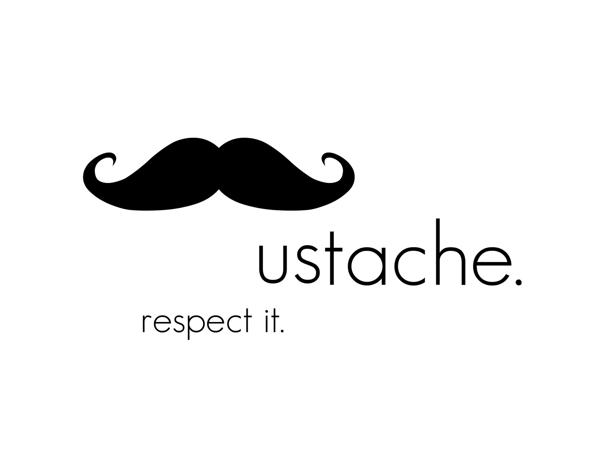

class: center, middle

# *intentionally left blank*

---

class: img-slide


---

class: center, middle

# *intentionally left blank*

---

<!-- このイベントは採用には関わらないですよという話をする。
ここで聞いたことを覚えているとか覚えてないとか、
あとでどう感じたかを面接で聞かれるとかそういうこともない。
だから安心で気軽に聞いてね -->

# 注意事項

## * NO INVESTIGATION
## * NO JUDGEMENT
## * NO EXAMINATION
## * FEEL FREE

---

class: ol

<!-- 話すこと -->

# 'll talk

## ウェブデザイナー・フロントエンドエンジニア（以下デザイナー）について
## 趣味 VS 受託制作 VS 事業会社
## ビズリーチのデザイナーの仕事【開発編】
## ビズリーチのデザイナーの仕事【運用編】
## まとめ

---

class: ol

<!-- 話さないこと -->

# 'll NOT talk

## ビズリーチの事業の詳細、将来性、展望
## ビズリーチの雇用環境や待遇
## デザイナーになるにはどうしたらよいか
## デザイン・技術的なトレンド、Tips

---

# 自己紹介

--

## * fullName: BABA Kyoya

## * age: 28

## * jobTitle: Frontend Engineer

---

class: img-slide


---

class: img-slide


---

class: img-slide


---

class: img-slide


---

class: img-slide


---

class: img-slide


---

class: img-slide


---

class: img-slide


---

<!-- ナビゲーション: デザイナー -->

<!-- ウェブデザイナーの立ち位置。
ウェブ開発、アプリケーション開発ビジネスの組織構造と、カウンターパートの説明 -->

# Web Designer?

--

## 　1. Product Owner / Producer

--

## 　　2. Product Manager / Director

--

## 　　　3. Functional Manager

--

## 　　　　4. Web Designer
## 　　　　5. Engineer (Frontend Engineer)
## 　　　　6. Programmer (Serverside Engineer)

---

class: img-slide

<!-- ウェブデザイナーは「デザインをする人」という印象もあり、
ファッションデザイナーのような花形職種だと思っている人もいるみたいだが、
実際全然そんなことない。
デザイナーというより設計者で、それは機械設備の設計者に似ています
人が使うことを想定して、彼らにはこういう情報をこういう順番で見せたらいい、
こういう操作をするためにこういうボタンが必要だよね、
ということを考える仕事です
 -->


---

class: img-slide

<!-- 多くの会社で「コーダー」「マークアップエンジニア」という職種があって、
デザインをする人とデザインされた原稿をコードに置き直す人が完全に分業されていることがあるけど、
「ウェブデザイナー」という肩書きの人が、実際に自分でそのコードを作る場面も多々あります。
「デザイナー」が「デザインをする人」ではないというのはこういう理由からもです。 -->


---

class: img-slide

<!-- 一方、「フロントエンドエンジニア」は、先ほど述べた内容に加えて、より高度なプログラミング実装が求められる場合があります。
たとえば、会員登録した情報をデータベースに保存して、それをデータベースから取得して画面に表示するとか。 -->


---

class: img-slide

<!-- 一方、データベースや裏側の処理は「サーバーサイドエンジニア」に引き継ぐので、
カウンターパートとしていっしょに業務していくことにあんります -->


---

<!-- ナビゲーション: 趣味 VS 受託制作 VS 事業会社 -->

<!-- 今回は、ウェブサービスに携わるウェブデザイナーというテーマですので、
まずはそもそもウェブデザイナーにはどんな種類があるのかということを
見ていきたいと思います。
主に３つのカテゴリーがあります -->

# 趣味 VS 受託制作 VS 事業会社

---

class: img-slide

<!-- 趣味で家でサイトを作ったことがある人もいるでしょう。 -->


--

.overlay[
  ## 趣味でやると...
  ## * 自由な目的
  ## * 自由なデザイン
  ## * 自由な構成
  ## * 自由な内容
  ## * 仲間次第
]

---

class: img-slide

<!-- 受託制作という働き方もあります。
ウェブサイトが必要だという顧客の要望をもとに、
制作会社がウェブサイトの開発を請け負ったり。
場合によっては、ゼロベースで事業を実現するための
ウェブサイトの提案をしたりもします。
 -->


--

.overlay[
  ## * クライアントとの戦い
  ## * 目的は（主に）お金
  ## * 意外といろいろなことに挑戦できる
  ## * 自信があればなんでもできる
  ## * （基本的に）開発が終了したらおわり
]

---

class: img-slide

<!-- 事業会社は、これは弊社もそうなのですが、すべてが社内で完結します。
基本的に顧客というのはエンドユーザー、つまり実際にサイトを公開してお客さんに
使ってもらい、そこから収益をあげるというための開発に携わります。 -->


--

.overlay[
  ## 事業会社で働くと
  ## * 具体的でスケーラブルな目的
  ## * 目的を達成するためのデザイン
  ## * 目的を達成するための構成、内容
  ## * 目的に対して責任を果たす
]

<!-- 弊社の場合は、先ほどお見せしたように、ビズリーチやキャリアトレック、スタンバイなどの採用・求人を目的とした
媒体で、「人を採用したい」という会社と「就職、転職したい、アルバイトをしたい」という一般の人たちをそれぞれ
２種類の顧客として事業を展開しています -->

---

class: img-slide

<!-- 主に３種類のウェブデザイナーの業務形態があることを示しましたが、
ここで自分はどこに向いているんだろう、と考えてみるのもいいと思います。 -->


---

class: img-slide

<!-- 趣味 - 非政府主義者、芸術家 -->


---

class: img-slide

<!-- 受託 - 狩猟民族、積分派 -->


---

class: img-slide

<!-- 事業会社 - 農耕民族、微分派 -->


---

class: img-slide

<!-- とはいえ、のんびり農業をやるというイメージではなく、
最新設備を使って効率性をあげて、その設備を管理する人たち
というイメージが近いかもしれません -->


---

<!-- ナビゲーション: 開発 -->

# 事業会社の特徴

--

## 1. 永続的に改善を図る

<!-- // 企画 -> 制作 -> 運用 -> 改善 -> 企画し直し -> 制作 -> 運用 -> 改善 -> やっぱり別なことやろう -> 全部やり直し -->

---

# 事業会社の特徴

## 2. チームでの開発

<!-- ひとりじゃない。作業を分担して、みんなでひとつのものを作り上げる。
「作り終わる」ことが目的ではないので、お互いにこうしたらよい、ここはこうしようなどの
アドバイスをしあったりする -->

---

# 事業会社の特徴

## 3. コーポレート・ブランディング

<!-- 会社という組織のブランディングも必要だ。
儲かればなんでもいいというわけではないし、
仕事が早く終えられればなんでもいいというわけでもない。
ユーザーに使ってもらえるような創意工夫、
かっこいいよね、かわいいよね、と思ってもらえるような
戦略も必要だ。 -->

---

# 事業会社の特徴

## 4. 開発の汎用性・保守性

<!-- リファクタがなぜ必要なのか

ソースコード、プログラムを美しくシンプルに整理して仕事を続けたところで、それは顧客には何ら影響はありません。

「外部に対する振る舞いを変更しないのならユーザに対して何の価値もないじゃないか！時間の無駄だ！」という人もいる

「将来にわたってそのソフトウェアを変更しない場合」はそれでOK

決して自分たちの「美学」や「自己満足」のためではなく、内部構造を自分たちのために変更するということ

ソースコードの可読性の向上のためであり、保守性を向上するため

弊社では、「リファクタリングしたよ」ってわざわざ報告するようなものではなく、「あ、このメソッド、こっちに移動したんだね。なるほど。」といったカジュアルな会話ができるプロジェクトチームを目指しています -->

---

<!-- 作ったことあるかどうか知らないけど、開発の突っ込んだ話もしましょう。
ウェブサイトは、一般的には以下のようなプロセスで構築されます。これらが、主なウェブデザイナーの仕事です -->

# 1. デザイン
# 2. HTML
# 3. CSS
# 4. JavaScript
# 5. その他

---

<!-- じゃあデザインというのは具体的にどんなことをやるのか -->

# 1. デザイン ←
# 2. HTML
# 3. CSS
# 4. JavaScript
# 5. その他

---

class: img-slide

<!-- デザインといっても、先ほど行ったように「絵を描く」「色をつける」ことではなく、「設計をする」ことだよ。
-->


---

# 制約

---

class: img-slide

<!-- 制約はあります。たとえば色
先ほど代表的なサービス６つのご紹介をしましたが、 -->


---

class: img-slide

<!-- それぞれコーポレートカラーというのが決まっていて、この
サービスを表す色はこの色なんだ、というのがあって勝手に変えられるわけではない -->


---

# コンポーネント

---

class: img-slide

<!-- # コンポーネントいろいろ。そもそも、ウェブサイトをつくる上でのコンポーネントって
なんだろう。というところを説明しよう。
コンポーネントなしというのもあるけど、斬新なことをしようとしているわけではない -->


---

# ワイヤーフレーム

---

class: img-slide

<!-- 事業としてウェブサイトを展開する以上、それはウェブデザイナーだけ
の責任ではなく、会社全体の責任ともなりえるものです。
そのため、本当に必要な項目はこれだけだろうか、
ここにこういうものを置かないといけないんじゃないか、
むしろここにこういうものを置いてはユーザーにとって
ノイズになってしまうんじゃないかといったことを時間をかけて考えます -->


---

# プロトタイピングテスト

---

class: img-slide


---

# モックアップ

---

class: img-slide


---

# レビュー

---

# 1. デザイン
# 2. HTML ←
# 3. CSS
# 4. JavaScript
# 5. その他

---

class: img-slide


<!-- HTMLのルールといっても、タグの書き方やどういう構造でマークアップするかというのはあまりにも当たり前なので、正直まったく会話にあがることはない
世間的に当たり前にやらなKればならないことは当然自社内でもやるし、
それ以外の細かいところで -->

---

# ディレクトリ構成

---

### app
### └ _js
### 　 └ vendor
### └ _scss
### └ images
### 　 └ backgrounds
### └ index.html
### └ index.md
### └ scripts
### 　 └ min
### └ styles
### 　 └ min
### gulpfile.js
### node_modules
### package.json

---

# コードフォーマット、ルール

---

class: img-slide


---

# × `<input type='text'>`
# ◯ `<input type="text">`

---

# × `<p>You & Me</p>`
# ◯ `<p>You &amp; Me</p>`

---

```
<input
  id=""
  class=""
  name=""
  value=""
  data-value=""
  ng-blur=""
>
```

---

# 1. デザイン
# 2. HTML
# 3. CSS ←
# 4. JavaScript
# 5. その他

---

class: img-slide


---

# × opacity: .5;
# ◯ opacity: 0.5;

---

# × color: #ccc;
# ◯ color: #CCCCCC;

---

```
.sg-header {
  position: relative; // 配置系要素
  display: block; // 表示系要素
  width: 100%; // ボックスモデル系要素
  border: 1px solid #EEEEEE; // ボーダー系要素
  background-color: #FFFFFF; // 背景系
  text-aling: center; // テキスト系
}
```

---

# sg, pg ルール

--

## ex. class="sg-hoge"
## ex. class="pg-fuga"

---

# 名前空間方式によるスタイル定義

--

## × header { color: #FF0000; }
## ◯ .sg-header { color: #FF0000; }

---

# ファイルの分散処理

--

## bizreach.scss
##　└ _bizreach-header.scss
##　└ _bizreach-footer.scss
##　└ _bizreach-buttons.scss
##　└ _bizreach-fonts.scss
##　└ _bizreach-index.scss

---

# 1. デザイン
# 2. HTML
# 3. CSS
# 4. JavaScript ←
# 5. その他

---

class: img-slide


---

class: img-slide


---

class: img-slide


---

class: img-slide


---

class: img-slide


---

class: img-slide


---

class: img-slide



---

class: img-slide


---

class: img-slide


---

class: img-slide


---

class: img-slide


---

# 1. デザイン
# 2. HTML
# 3. CSS
# 4. JavaScript
# 5. その他 ←

---

class: img-slide

<!-- ナビゲーション: 運用 -->


.overlay[
  # * デザインレビュー
  # * ソースコードレビュー
]

---

class: img-slide

<!-- ナビゲーション: 運用 -->


<!-- * デザイン - フロントエンド - バックエンドを横断的に見れる的なこと -->
<!-- 新しい技術への恐れを克服する的なこと
  * 個人的な干渉に惑わされずに仕事ができるよ -->

.overlay[
  # * 勉強会
]

---

class: img-slide


.overlay[
  # * イベント
]

---

<!-- ナビゲーション: まとめ -->

# まとめ

---

# 以上です

---

# お聴きいただき、ありがとうございました！
