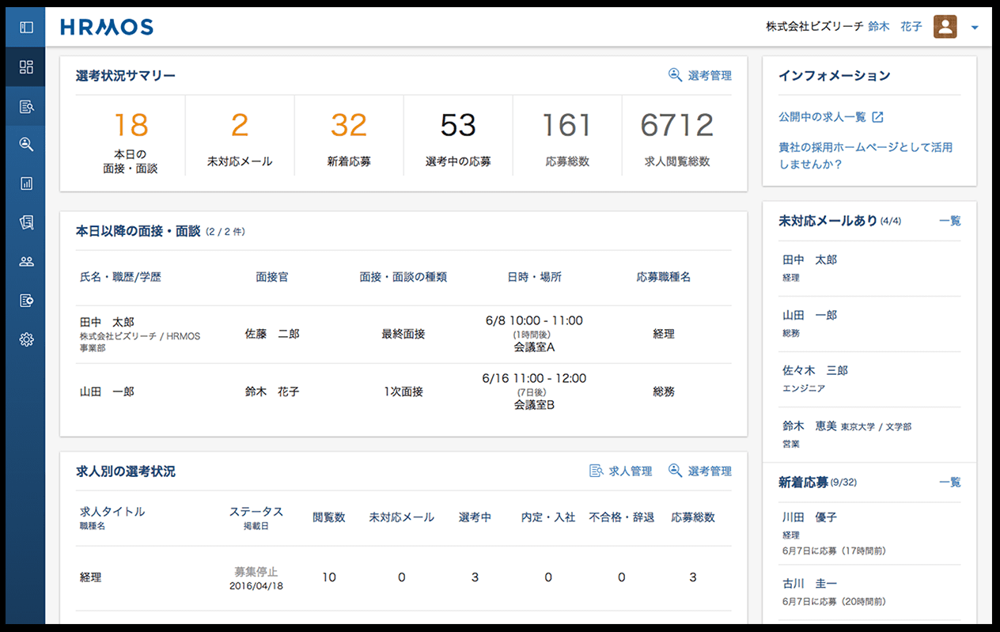
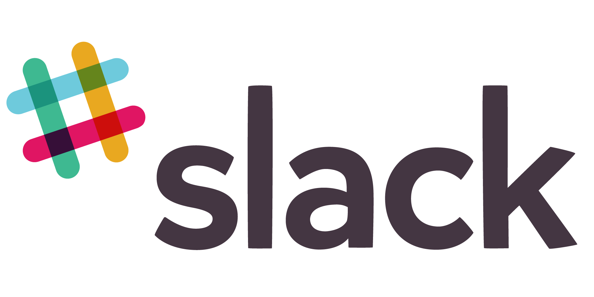

class: center, middle

# *intentionally left blank*

---

class: img-slide


---

# this is h1

## this is h2

- list-item
- list-item
- list-item
  - list-item
  - list-item
  - list-item

---

1. ordered-list-item
1. ordered-list-item
1. ordered-list-item
  1. ordered-list-item
  1. ordered-list-item
  1. ordered-list-item

| Left align | Right align | Center align |
|:-----------|------------:|:------------:|
| This       |        This |     This     |

`inline code`

```
block code
```

---

## wi-fi

| SSID | Password |
|:-----------|:-----------|
| BIZREACH_GUEST | iwilljoinbizreach |

## お手洗い

後ろの左側へ。

## スケジュール

| hh:mm | hh:mm | hh:mm | hh:mm |
|:-----------|:-----------|:-----------|:-----------|
| 発表開始 | 質疑応答 | 懇親会 | 完全撤収 |

---

# プロフィール

## Kyoya BABA

- 28
- 札幌
- 経歴
  - 2010 プロダクトマネージャー
  - 2012 エディトリアルマネージャー
  - 2013 プロジェクトマネージャー
  - 2014 ウェブデザイナー
  - 2015 フリーランス
  - 2016 フロントエンドエンジニア <- 今ここ

---

## SNSやってます

| Facebook | Twitter | LinkedIn |
|:-----------:|:-----------:|:-----------:|
|  |  |  |
| Qiita | filmarks | LINE |
|  |  |  |

---

## 現在

### 株式会社ビズリーチHRMOS事業部
### フロントエンドエンジニア

--

- UI / UXデザイン
- フロントエンドコーディング
- 広告マーケティング

---

## アジェンダ

- \#1 プロダクトについて
- \#2 フロントエンド開発のルールづくり
- \#3 HRMOSを支える技術
- \#4 チームマネジメント
- \#5 質疑応答
- \#6 懇親会

---

# \#1 プロダクトについて

---


---


---


---


---


---

## HRMOSとはなんなのか

---


---


---



---


---


---


---


---


---


---


---


---

## 技術スタック

---

## 技術スタック

### デザイン

---


---


---


---


---

## 技術スタック

### フロントエンド

---


---


---


---


---


---


---


---


---


---


---

## 技術スタック

- チームコミュニケーション

---


---



---


---


---


---

## 技術スタック

- その他サーバサイド的なものたち
  - Java
  - Scala
  - Python
  - Play Framework
  - Slick
  - Nginx
  - MySQL
  - Elasticsearch
  - Memcached
  - Docker
  - Ansible
  - SQS
  - CloudFront
  - Jenkins
  - Kibana
  - Mailgun
  - etc...

---

# \#2 フロントエンド開発のルールづくり

---

# \#2 フロントエンド開発のルールづくり

ルールって何？

---

## ルールって何？

- こたえ:

--

  - 複数の開発者が

--

  - 共通の認識・価値観を持ち

--

  - お互いの作業を理解し

--

  - 無駄な / 重複した / 危険な 仕事をしないための

--

  - 明文化された規則

---

## 9 Boxの考え方

--

||||
|:-----------:|:-----------:|:-----------:|
|1|2|3|
|4|5|6|
|7|8|9|

---

## 案１

```
<table>
  <tbody>
    <tr> <td>1</td> <td>2</td> <td>3</td> </tr>
    <tr> <td>4</td> <td>5</td> <td>6</td> </tr>
    <tr> <td>7</td> <td>8</td> <td>9</td> </tr>
  </tbody>
</table>
```

---

## 案２

```
<ol>
  <li>1</li> <li>2</li> <li>3</li>
  <li>4</li> <li>5</li> <li>6</li>
  <li>7</li> <li>8</li> <li>9</li>
</ol>
```

---

## 案３

```
<ol>
  <li>1</li> <li>2</li> <li>3</li>
</ol>
<ol>
  <li>4</li> <li>5</li> <li>6</li>
</ol>
<ol>
  <li>7</li> <li>8</li> <li>9</li>
</ol>
```

---

## 案４

```
<p>123</p>
<p>456</p>
<p>789</p>
```

---

## 9 Box

- 正解は無い

--

- => 状況によって正解が分かれる

--

- => コードは、機械（ブラウザ・クローラ・データ）のためでもあるが
- => 人間（開発者・チームメンバ）のためでもある

--

### >>> _状況_ によって _正解_ を使い分けるためのルール

---

# ルールの種類

--

- 株式会社ビズリーチが全社的に定めているもの
- HRMOS事業部が独自に設定しているもの
- かってに

---

## 修正容易性・可読性・生産性？

<!-- 9 Boxの例 -->
![](http://dummyimage.hrmoscom/1200x900/000/FFF

---

## サーバサイドとフロントエンドの親和性？

<!--
いかにもサーバサイドからデータをもらってる的な画面を出して、ここにデータをもらうとき。。。みたいな話をする
-->
![](http://dummyimage.hrmoscom/1200x900/000/FFF

---

## コンポーネント化による共通化？

---

# #2 フロントエンド開発のルールづくり

1. 株式会社ビズリーチ全社で定めているルール
1. HRMOS事業部で独自運用しているルール
1. ぼくがかってにきめてきせいじじつにしたるーる

---

# #2 フロントエンド開発のルールづくり

1. かっこいい名前空間の定義
1. かっこいいコンポーネント化
1. かっこいいコードレビュー

---

## かっこいいとは何か

- 整理整頓されていること
  - 家が汚い -> かっこわるい
- 現代的であること
  - 昔ながらが一番やで -> かっこわるい
- 意味がわかること
  - お前らには難しくてわからんやろ（ドヤァ） -> かっこわるい
- チームメンバを尊敬しあえること
  - おれ一人で生きていけるし -> かっこわるい

---

## かっこいい名前空間の定義

1. sgクラスによる共通スタイル定義
1. pgクラスによる下位構造スタイル定義
1. 補助クラスによる状態定義
1. セレクタマッチングによるHTMLの簡素化
1. JavaScript用のid / class達

<!-- 以下、↑について細かく説明する -->

---

## かっこいいコンポーネント化

- まずはコンポーネントを分けよう！（簡単な例）
  - gulpfile.js
  - pages/
    - index.ejs
    - component/
      - head.ejs
      - header.ejs
      - footer.ejs
      - sidebar.ejs
      - google-analytics.ejs
  - assets/
    - images/
    - scripts/
    - styles/
    - icons/

---

## かっこいいコンポーネント化

- まずはコンポーネントを分けよう！（やや実例）
  - app/
    - base/
      - config/
        - なんかconfig系
      - constants/
        - 定数とかEnumとか
      - ejs/
        - ベースとなるEJS(HTML)
      - components/
        - headerとかsidebarとかdatePickerとか
      - helpers/
        - paginationとかvalidationとか
    - ats/
      - login/
      - dashboard/
      - applications/
      - jobs/
  - assets/
    - images/
    - scripts/
    - styles/
    - icons/

---

## かっこいいコードレビュー

<!-- なんか -->

---

## 具体的なコーディング規約

```
なんか書く
```

---

# #3 HRMOSを支える技術

---

# #3 HRMOSを支える技術

- AngularJSからReactへ <- 何を書いたらいんやろ

---

# #3 HRMOSを支える技術

- TypeScriptによる型のある開発

---

# #3 HRMOSを支える技術

- gulp秘伝のタレ

---

# #3 HRMOSを支える技術

- 品質改善で心がけていること

---
